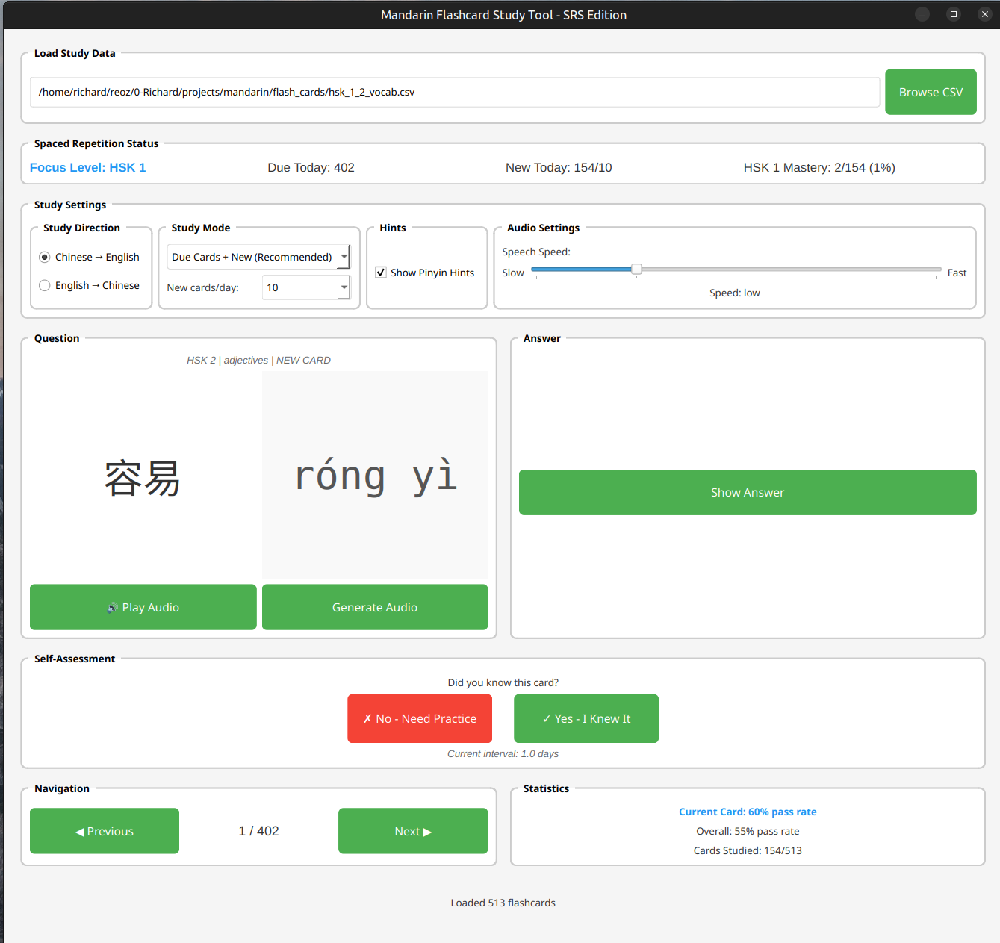
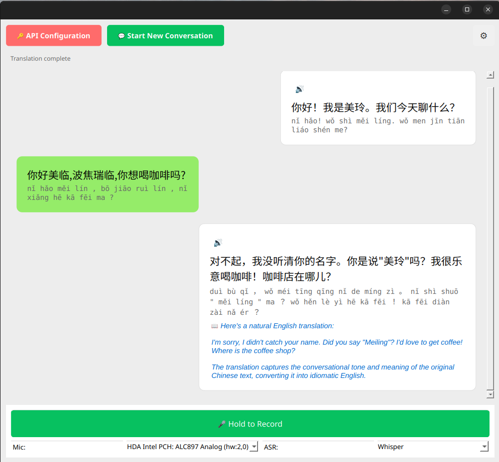

# Mandarin Learning Tools

A comprehensive suite of PyQt6-based applications for practicing Mandarin Chinese - featuring listening comprehension, flashcard study with spaced repetition, and free-form conversation practice.

## Tools Overview

### 1. Mandarin Listening Practice
A tool for improving Chinese listening comprehension skills through audio generation and translation exercises.


**Features:**
- Load CSV files with Chinese-English translation pairs
- Generate natural-sounding Chinese audio using SparkTTS
- Adjustable speech speed (slow to fast)
- Score translation accuracy with feedback
- Track progress with current, previous, and average scores
- Navigate through exercises with previous/next buttons

### 2. Mandarin Flashcard Study Tool (SRS Edition)
A sophisticated flashcard application with spaced repetition system (SRS) for efficient vocabulary acquisition.



**Features:**
- **Spaced Repetition Algorithm**: SM-2 based review scheduling
- **HSK Level Progression**: Automatic focus level management (HSK 1-6)
- **Bidirectional Study**: Practice Chinese → English or English → Chinese
- **Customizable Display**: Toggle Chinese characters and pinyin hints
- **Audio Generation**: Natural TTS with adjustable speed
- **Smart Study Modes**:
  - Due cards + new cards (recommended)
  - Focus level only
  - All cards (manual review)
- **Progress Tracking**: 
  - Daily new card limits
  - Mastery percentage by HSK level
  - Review intervals and accuracy statistics
- **Self-Assessment**: Simple pass/fail grading that adjusts review intervals

### 3. 美玲 (Měilíng) - Free Conversation Practice
An AI-powered conversation partner for practicing natural Mandarin dialogue with real-time speech recognition and synthesis.



**Features:**
- **Natural Conversation**: Chat-style interface with context-aware responses
- **Multiple ASR Models**: Choose between Whisper and SenseVoice
- **Audio Recording**: Hold-to-record with level monitoring
- **TTS Playback**: Natural Chinese audio responses
- **HSK-Aware Responses**: AI adjusts vocabulary complexity (HSK 1-6)
- **Translation on Demand**: Right-click any message for instant translation
- **Configurable Hints**: Toggle Chinese characters and pinyin display
- **Claude API Integration**: Natural conversation using Claude 3.5 models
- **Cost Effective**: ~$0.12-$4/month for daily practice

## Installation

### Prerequisites
- Python 3.8+
- PyQt6
- CUDA-compatible GPU (recommended for neural models)

### System Dependencies

Install system audio libraries:

**Ubuntu/Debian:**
```bash
sudo apt update
sudo apt install portaudio19-dev python3-dev
sudo apt install libasound2-dev  # For ALSA support
```

**macOS:**
```bash
brew install portaudio
```

**Windows:**
- PortAudio is typically included with Python audio packages

### Python Dependencies

```bash
pip install PyQt6 PyQt6-Multimedia
pip install pandas numpy soundfile sounddevice
pip install torch torchaudio  # Install PyTorch for your system
pip install openai-whisper
pip install pypinyin opencc opencc-python-reimplemented
pip install anthropic  # For conversation mode
```

### Neural Network Models

#### 1. SparkTTS (Required for all tools)

Clone and set up SparkTTS:
```bash
cd ~/software  # or your preferred directory
git clone https://github.com/SparkAudio/Spark-TTS.git
cd Spark-TTS
pip install -r requirements.txt
```

Download the pretrained model:
```bash
mkdir -p pretrained_models

# Make sure you have git-lfs installed (https://git-lfs.com)
git lfs install

git clone https://huggingface.co/SparkAudio/Spark-TTS-0.5B pretrained_models/Spark-TTS-0.5B
```

#### 2. SenseVoice (Optional - for enhanced Chinese ASR)

Clone and set up SenseVoice:
```bash
cd ~/software
git clone https://github.com/FunAudioLLM/SenseVoice.git
cd SenseVoice
pip install -r requirements.txt
pip install funasr
```

#### 3. Whisper (Automatically downloaded)

Whisper models are downloaded automatically on first use. The applications use the "base" model by default for a good balance of speed and accuracy.

### Path Configuration

Update the model paths in the Python files to match your installation:

**Update these lines in each script:**
```python
# Add your Spark-TTS path
sys.path.append(os.path.expanduser("~/software/Spark-TTS/"))
sys.path.append(os.path.expanduser("~/software/SenseVoice/"))  # Speaking/Conversation tools

# Update model directory path
model_dir = "/path/to/your/Spark-TTS/pretrained_models/Spark-TTS-0.5B/"

# Update audio sample path
"/path/to/your/Spark-TTS/example/primsluer1.flac"
```

### Claude API Setup (For Conversation Tool)

1. Get your API key from [console.anthropic.com](https://console.anthropic.com)
2. In the app, click "🔑 API Configuration"
3. Enter your API key and select your preferred model:
   - **Haiku**: Most economical (~$0.12/month for daily practice)
   - **Sonnet**: Better conversations (~$1-4/month)
4. Choose your HSK level (1-6) for vocabulary-appropriate responses

## Usage

### Data Format

Tools expect CSV files with these columns:
- `zh`: Chinese text
- `eng`: English translation
- `pinyin`: Pinyin (auto-generated if missing)
- `hsk_level`: HSK difficulty level (1-6)
- `theme`: Topic category (optional)
- Additional SRS columns are auto-generated

Example CSV:
```csv
zh,eng,pinyin,hsk_level,theme
你好,Hello,nǐ hǎo,1,greetings
谢谢,Thank you,xiè xiè,1,greetings
再见,Goodbye,zài jiàn,1,greetings
我想吃饭,I want to eat,wǒ xiǎng chī fàn,2,food
```

### Running the Applications

**Listening Practice:**
```bash
python mandarin_listening_practice.py
```

**Flashcard Study:**
```bash
python mandarin_flashcard_srs.py
```

**Free Conversation:**
```bash
python meiling_conversation.py
```

### Screenshots

Store screenshots in a `screenshots/` directory:
- `screenshots/listening_practice.png` - Listening practice interface
- `screenshots/flashcard_practice.png` - Flashcard study interface  
- `screenshots/meiling_conversation.png` - Conversation practice interface

## Troubleshooting

### Audio Issues
- **No microphone detected**: Check system audio settings and permissions
- **Recording fails**: Try different microphones or close other audio applications
- **Poor audio quality**: Ensure good microphone positioning and quiet environment

### Model Loading Issues
- **SparkTTS fails to load**: Verify model path and ensure all model files are downloaded
- **CUDA out of memory**: Use CPU mode by modifying the device selection in the code
- **SenseVoice unavailable**: The tools will fall back to Whisper automatically

### API Issues (Conversation Tool)
- **API key errors**: Verify key is correct and has available credits
- **Rate limits**: Wait a moment between requests
- **Model unavailable**: Try switching to Haiku model in settings

### Performance Tips
- Use CUDA GPU for faster model inference
- Close unnecessary applications when recording
- Use a dedicated USB microphone for better audio quality
- Adjust audio buffer sizes if experiencing dropouts
- Start with Haiku model for faster, cheaper responses

## Features Explained

### Spaced Repetition System (SRS)
The flashcard tool uses a modified SM-2 algorithm:
- **Initial interval**: 1 day (after first correct answer)
- **Second interval**: 6 days (after second correct answer)
- **Subsequent intervals**: Multiplied by ease factor (1.3-3.0)
- **Failed cards**: Reset to 1 day interval
- **Automatic progression**: Advances through HSK levels based on mastery

### Scoring System
- **Character similarity**: Direct text comparison after normalization
- **Pinyin matching**: Pronunciation-based scoring (listening tool)
- **Pass/Fail grading**: Simple self-assessment (flashcard tool)
- **Progress tracking**: Current, previous, and running average scores
- **Detailed feedback**: Specific areas for improvement

### Audio Processing
- **Multiple sample rates**: Automatic detection of supported rates
- **Audio preprocessing**: Noise reduction and normalization
- **Real-time monitoring**: Visual audio level feedback
- **Cross-platform compatibility**: Works on Windows, macOS, and Linux

### Conversation Features
- **Context awareness**: Maintains conversation history
- **HSK-appropriate responses**: Vocabulary matches your level
- **Natural pacing**: Short, conversational responses
- **Translation helper**: Right-click any Chinese text for instant English translation
- **Offline fallback**: Works without API for basic playback features

## Learning Workflow

**Recommended Study Approach:**

1. **Daily Flashcard Review** (10-15 min)
   - Start with "Due Cards + New" mode
   - Review scheduled cards
   - Learn new vocabulary from focus HSK level
   - Progress automatically to next level at 80% mastery

2. **Listening Practice** (10-15 min)
   - Practice with current HSK level vocabulary
   - Start with slow speed, increase as comfortable
   - Focus on accuracy over speed

3. **Conversation Practice** (10-20 min)
   - Use 美玲 for free-form conversation
   - Set HSK level to match or slightly exceed flashcard level
   - Practice natural dialogue patterns
   - Use translation feature to learn new phrases

## License

These tools are provided for educational purposes. Please ensure compliance with the licenses of the underlying models:
- SparkTTS: Check the original repository license
- SenseVoice: Check the FunAudioLLM license
- Whisper: MIT License (OpenAI)
- Claude API: Anthropic Terms of Service

## Contributing

Feel free to submit issues or improvements. Common enhancement areas:
- Additional language support
- More sophisticated scoring algorithms
- Better audio preprocessing
- UI/UX improvements
- Additional TTS models integration
- Conversation dialogue analysis
- Vocabulary export features

## Credits

Built with:
- PyQt6 for GUI
- SparkTTS for Chinese text-to-speech
- Whisper/SenseVoice for speech recognition
- Claude 3.5 for natural conversation
- pypinyin for romanization