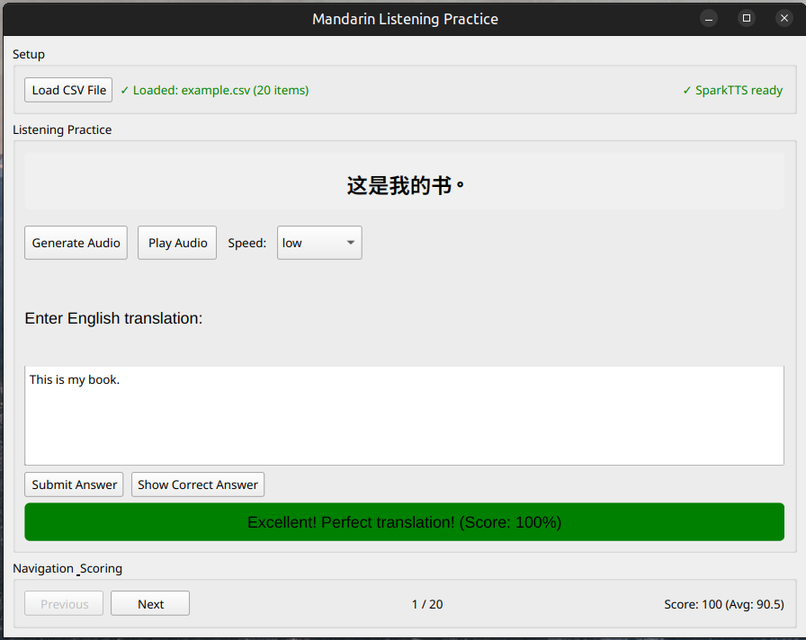
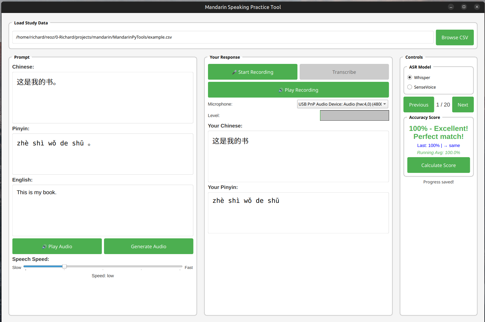

# Mandarin Learning Tools

Two PyQt6-based applications for practicing Mandarin Chinese - one focused on listening comprehension and another on pronunciation/speaking practice.

## Tools Overview

### 1. Mandarin Listening Practice
A tool for improving Chinese listening comprehension skills through audio generation and translation exercises.



**Features:**
- Load CSV files with Chinese-English translation pairs
- Generate natural-sounding Chinese audio using SparkTTS
- Adjustable speech speed (slow to fast)
- Score translation accuracy with feedback
- Track progress with current, previous, and average scores
- Navigate through exercises with previous/next buttons

### 2. Mandarin Speaking Practice
A comprehensive tool for practicing Chinese pronunciation with real-time feedback and multiple speech recognition models.



**Features:**
- Audio recording with level monitoring
- Multiple ASR models: Whisper and SenseVoice
- Real-time audio level visualization
- Pinyin generation and display
- Pronunciation accuracy scoring with detailed feedback
- Progress tracking and CSV export
- Audio playback for both prompts and recordings
- Microphone selection and monitoring

## Installation

### Prerequisites
- Python 3.8+
- PyQt6
- CUDA-compatible GPU (recommended for neural models)

### System Dependencies

Install system audio libraries:

**Ubuntu/Debian:**
```bash
sudo apt update
sudo apt install portaudio19-dev python3-dev
sudo apt install libasound2-dev  # For ALSA support
```

**macOS:**
```bash
brew install portaudio
```

**Windows:**
- PortAudio is typically included with Python audio packages

### Python Dependencies

```bash
pip install PyQt6 PyQt6-Multimedia
pip install pandas numpy soundfile sounddevice
pip install torch torchaudio  # Install PyTorch for your system
pip install openai-whisper
pip install pypinyin opencc
pip install opencc-python-reimplemented  # Alternative if opencc fails
```

### Neural Network Models

#### 1. SparkTTS (Required for both tools)

Clone and set up SparkTTS:
```bash
cd ~/software  # or your preferred directory
git clone https://github.com/SparkAudio/Spark-TTS.git
cd Spark-TTS
pip install -r requirements.txt
```

Download the pretrained model:
```bash
mkdir -p pretrained_models

# Make sure you have git-lfs installed (https://git-lfs.com)
git lfs install

git clone https://huggingface.co/SparkAudio/Spark-TTS-0.5B pretrained_models/Spark-TTS-0.5B
```

#### 2. SenseVoice (Optional - for enhanced Chinese ASR)

Clone and set up SenseVoice:
```bash
cd ~/software
git clone https://github.com/FunAudioLLM/SenseVoice.git
cd SenseVoice
pip install -r requirements.txt
pip install funasr
```

#### 3. Whisper (Automatically downloaded)

Whisper models are downloaded automatically on first use. The applications use the "base" model by default for a good balance of speed and accuracy.

### Path Configuration

Update the model paths in both Python files to match your installation:

**In both files, update these lines:**
```python
# Add your Spark-TTS path
sys.path.append(os.path.expanduser("~/software/Spark-TTS/"))
sys.path.append(os.path.expanduser("~/software/SenseVoice/"))  # Speaking tool only

# Update model directory path
model_dir = "/path/to/your/Spark-TTS/pretrained_models/Spark-TTS-0.5B/"

# Update audio sample path (speaking tool)
"/path/to/your/Spark-TTS/example/primsluer1.flac"
```

## Usage

### Data Format

Both tools expect CSV files with these columns:
- `zh`: Chinese text
- `eng`: English translation
- `pinyin`: Pinyin (auto-generated if missing)
- `score`: Accuracy scores (auto-generated)
- Additional scoring columns are created automatically

Example CSV:
```csv
zh,eng,pinyin
你好,Hello,nǐ hǎo
谢谢,Thank you,xiè xiè
再见,Goodbye,zài jiàn
```

### Running the Applications

**Listening Practice:**
```bash
python mandarin_listening_practice.py
```

**Speaking Practice:**
```bash
python mandarin_speaking_practice.py
```

### Screenshots

Store screenshots in a `screenshots/` directory:
- `screenshots/listening_practice.png` - Listening practice interface
- `screenshots/speaking_practice.png` - Speaking practice interface

## Troubleshooting

### Audio Issues
- **No microphone detected**: Check system audio settings and permissions
- **Recording fails**: Try different microphones or close other audio applications
- **Poor audio quality**: Ensure good microphone positioning and quiet environment

### Model Loading Issues
- **SparkTTS fails to load**: Verify model path and ensure all model files are downloaded
- **CUDA out of memory**: Use CPU mode by modifying the device selection in the code
- **SenseVoice unavailable**: The speaking tool will fall back to Whisper automatically

### Performance Tips
- Use CUDA GPU for faster model inference
- Close unnecessary applications when recording
- Use a dedicated USB microphone for better audio quality
- Adjust audio buffer sizes if experiencing dropouts

## Features Explained

### Scoring System
Both tools use sophisticated scoring algorithms:
- **Character similarity**: Direct text comparison after normalization
- **Pinyin matching**: Pronunciation-based scoring
- **Progress tracking**: Current, previous, and running average scores
- **Detailed feedback**: Specific areas for improvement

### Audio Processing
- **Multiple sample rates**: Automatic detection of supported rates
- **Audio preprocessing**: Noise reduction and normalization
- **Real-time monitoring**: Visual audio level feedback
- **Cross-platform compatibility**: Works on Windows, macOS, and Linux

## License

These tools are provided for educational purposes. Please ensure compliance with the licenses of the underlying models:
- SparkTTS: Check the original repository license
- SenseVoice: Check the FunAudioLLM license
- Whisper: MIT License (OpenAI)

## Contributing

Feel free to submit issues or improvements. Common enhancement areas:
- Additional language support
- More sophisticated scoring algorithms
- Better audio preprocessing
- UI/UX improvements
- Additional TTS models integration